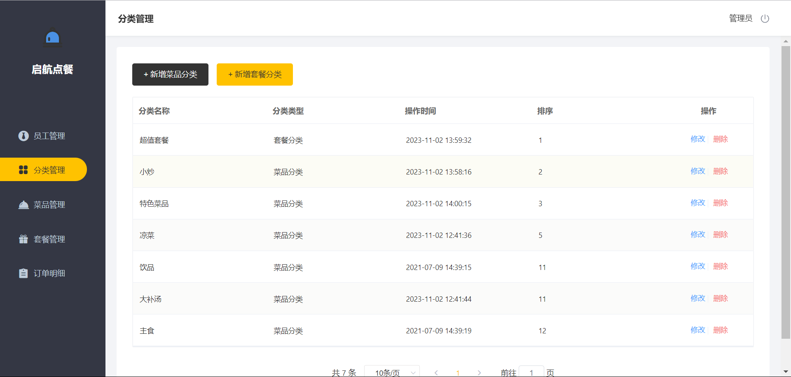
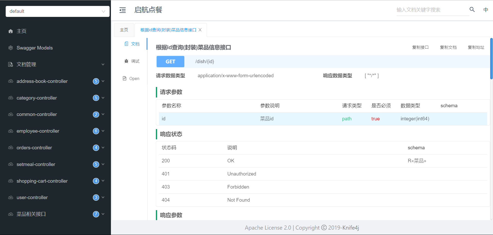

# 基于瑞吉外卖的启航点餐项目

# 项目介绍：

> 大家好！欢迎关注程序员小师，今天给大家带来的一个项目是：基于瑞吉外卖的启航点餐(Start ordering)项目。是专门为餐饮企业定制的一款软件产品，包括系统管理后台和移动端应用两部分。其中系统管理后台主要提供给餐饮企业内部员工使用，可以对餐厅的分类、菜品、套餐、订单、员工等进行管理维护。移动端应用主要提供给消费者使用，可以在线浏览菜品、添加购物车、下单等。感兴趣的接着往下看吧，喜欢的可以给了关注💕和start

# 技术选型：

开发工具：

- jdk 1.8
- tomcat 9.0
- Idea 19.3.3
- navicat

数据库：

- mysql    5.7以上都行

前端：

- H5 
- Vue 
- ElementUI 
- 微信小程序

后端：

- Java
- Java web
- Spring Boot
- SSM（Spring Spring MVC MyBatis)
- Maven

# 经典框架图：

# 项目展示：

## 前端：

### 登录：

### 首页

### 结算页面：

支付页面：

### 查看订单页面：

### 个人中心：

## 后端：

### 登录：

### 首页（员工管理）：

### 分类管理：

### 菜品管理：

### 套餐管理：

### 订单管理：

knife4j文档：

等等......

# 总结：

项目亮点

- 单体项目很适合拿来练手，一套框架的整合。（经典的项目，总是有收获的）
- 添加业务异常，封装了全局处理异常，屏蔽了项目中冗余的报错细节。
- 项目中用ThreadLocal封装了全局的上下文对象，项目中后台用户的信息处理，给了新的思路。
- 项目中使用了消息转换器，兼容date类型的序列化，自定义了Jackson对象映射处理日期。
- 自定义MyBatis Plus的 MetaObjectHander配合全局上下文实现写数据前的创建时间，用户id等字段的自动填充
- 遵循Restful风格的规范编程接口，降低前后端接口沟通和理解成本，很不错的的基础项目。
- 为了保证数据的完整性和一致性，使用@Transactional实现数据库事务，并配置rollbackfor=Exception.class（默认是非受检异常） 来支持受检异常的事务回滚
- 使用LambdaQueryWrapper实现更灵活，更方便。

## 升级.....

- 为了加速页面的响应速度，采用了Spring Cache 注解 + Redis 实现缓存操作，大幅度降低数据库的压力，将接口的响应提上到(88ms->8ms)

- 接入阿里云的短信服务，通过redis集中处理缓存验证码消息，防止手机号重复发送

- 集成Knfe4j+Swagger自动生成后端接口文档，通过注解的使用明确接口信息，避免了人工维护（文档）的麻烦。

  

有问题可以提交问题，喜欢交朋友，喜欢💕这个项目的可以给个start和给作者一个关注。

也欢迎关注作者的博客：[http://t.csdn.cn/fVZm9](https://blog.csdn.net/weixin_46585492) (目前在更算法文章喜欢可以关注一下)

联系方式：

QQ：2946364160

